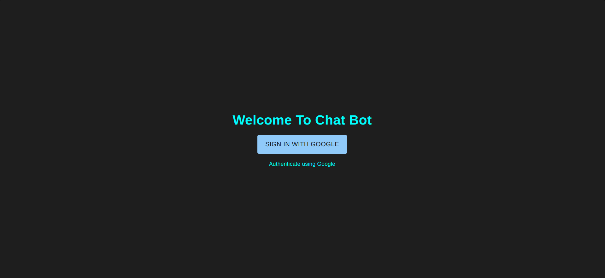
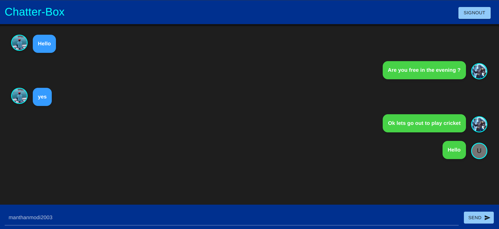

# Chatter-Box

Chatter-Box is a real-time chat application built with React and Firebase. It allows users to send messages, view chat history, and log out seamlessly. The UI is built using Material-UI for a modern and clean design.

## Features 🚀

### User Authentication

- Users can sign in using Firebase Authentication.
- Secure login with Google authentication.

### Real-Time Messaging

- Messages are stored and retrieved from Firebase Firestore.
- Messages appear instantly for all users in the chat.
- Messages are ordered chronologically.

### Modern UI with Material-UI

- Responsive and sleek design with Material-UI components.
- The chat header has a stylish appearance with a custom color scheme.
- Smooth scrolling and auto-layout for message display.

### Persistent Chat History

- Messages remain available even after page reloads.
- Uses Firestore to maintain a history of conversations.

### Sign Out Feature

- Users can securely log out of the application.

## Screenshots

### Login Page



### Chat Interface



## Installation & Setup 🛠️

1. Clone the repository:
   ```sh
   git clone https://github.com/your-repo/chatter-box.git
   cd chatter-box
   ```
2. Install dependencies:
   ```sh
   npm install
   ```
3. Set up Firebase:

   - Create a Firebase project.
   - Enable Firestore and Authentication.
   - Add your Firebase configuration to `FireBaseAuth.js`.

4. Start the application:
   ```sh
   npm start
   ```

## Technologies Used 🛠️

- React.js
- Firebase
- Material-UI

## Contributing

Feel free to fork the project, submit pull requests, or suggest features!

## License

This project is licensed under the MIT License.

---

Built with ❤️ using React & Firebase
